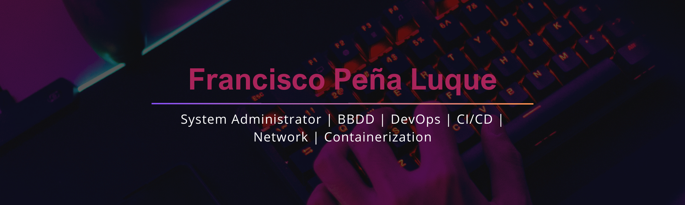

---

    
    
    

     
    

Apasionado de la informática, estudiando ciberseguridad.  
Me especializo en administración de sistemas informáticos. Bueno en algoritmos, Sistemas de Bases de Datos, habilidades para resolver problemas.
Me apasiona aprender, todas las tecnologías me interesan. Familiarizado con Linux, virtualización, NGINX,  Docker entre otros..  Responsable y comprometido, con espíritu de hacer las cosas a tiempo. Persona emprendedora, que aprende rápido, automotivada y sociable. Open to talk in english
    

    <ul>
        <li>🌱 <b>Estudios actuales</b>: Ciberseguridad</li>
        <li>📫 <b>Contacta conmigo</b>: Sígueme desde los enlaces anteriores 👆, además de seguirme aquí  en GitHub.</li>
       <!-- <li>🎯 <b>I’m currently focusing on</b>: <a href="https://ahmedfathydev.github.io/Problem-Solving/">Problem-Solving</a>, ⭐️ star the projects if you like it 🤩.</li>
        <li>🤔 <b>I’m currently open for</b>: A new job opportunity, <a href="https://flowcv.io/resume/feedback/lMhKFXfgJjf8">LINK TO MY RESUME</a>.</li>
        <li>💬 <b>Ask me about anything</b>: <a href="https://github.com/ahmedfathydev/ahmedfathydev/issues">Here</a>.</li>
        <li>👨‍💻 <b>Hire me for Full Stack Development jobs</b>: <a href="https://www.upwork.com/freelancers/~0121ca7f3563e57c0b?s=1110580755107926016">Link to my UpWork Full Stack Development Specialization</a>.</li>
        <li>👨‍💻 <b>Hire me for Back-End Development jobs</b>: <a href="https://www.upwork.com/freelancers/~0121ca7f3563e57c0b?s=1110580748673863680">Link to my UpWork Back-End Development Specialization</a>.</li>
        -->
    </ul>

    <h1>GitHub Stats</h1>
    

